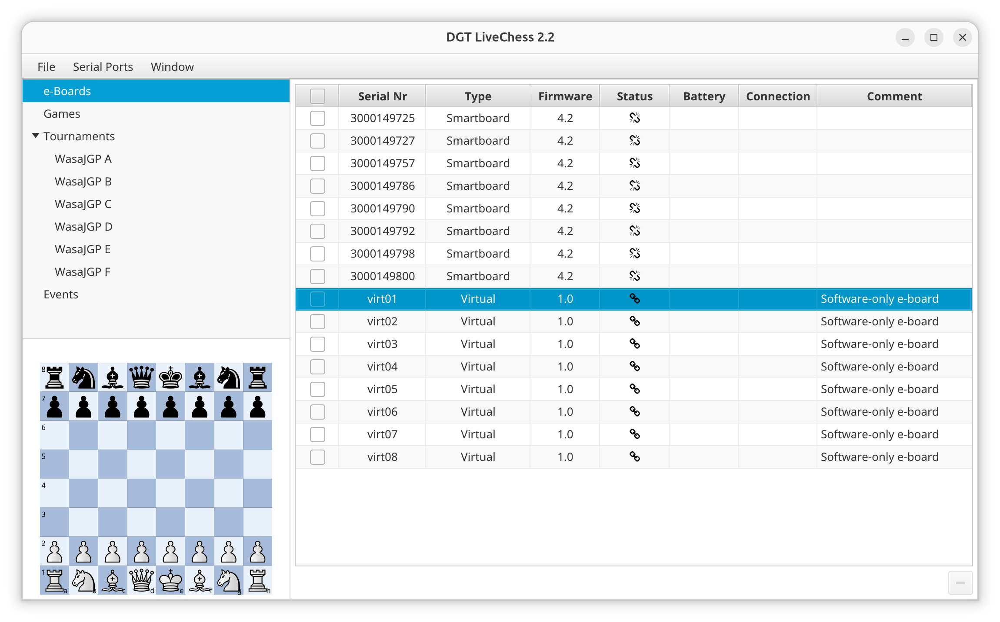

# dgtlivechess-hidpi

This repo patches DGT LiveChess 2.2 so it can run scaled on HiDPI displays and so it can be tested without a physical DGT board.

The patch adds eight built-in software-only e-boards, `virt01` through `virt08`. You can assign them to pairings and use them to test recording and board editing in LiveChess without connecting real hardware.



## Files

- [build.sh](build.sh)
  Downloads the runtime dependencies and compiles the compatibility classes into `./build/`.
- [dgtlivechess](dgtlivechess)
  Runtime wrapper. Uses the files produced by `./build.sh`.
- [compat-src/com/novotea/entity/ProxyUtil.java](compat-src/com/novotea/entity/ProxyUtil.java)
  Fixes Java 9+ default-method proxy dispatch.
- [compat-src/com/novotea/entity/ProxyEntityAccess.java](compat-src/com/novotea/entity/ProxyEntityAccess.java)
  Replaces the old proxy bootstrap path so it links cleanly on Java 11+.
- [compat-src/com/sun/javafx/scene/control/skin/BehaviorSkinBase.java](compat-src/com/sun/javafx/scene/control/skin/BehaviorSkinBase.java)
  Restores the removed JavaFX 8 skin base class expected by the app's custom controls.
- [compat-src/com/sun/javafx/scene/control/skin/CellSkinBase.java](compat-src/com/sun/javafx/scene/control/skin/CellSkinBase.java)
  Restores the removed JavaFX 8 cell skin base class expected by the app's custom cells.
- [compat-src/com/novotea/chess/javafx/ui/ItemViewBehaviour.java](compat-src/com/novotea/chess/javafx/ui/ItemViewBehaviour.java)
  Replaces the JavaFX 8-era item view behavior class that depended on removed traversal bindings.
- [compat-src/com/novotea/chess/javafx/ui/ItemCellBehaviour.java](compat-src/com/novotea/chess/javafx/ui/ItemCellBehaviour.java)
  Replaces the JavaFX 8-era item cell behavior class with a JavaFX 11-compatible version.
- [compat-src/com/novotea/ui/core/AbstractColumnUI.java](compat-src/com/novotea/ui/core/AbstractColumnUI.java)
  Replaces the removed JavaFX 8 internal `TableColumn.impl_setReorderable(...)` call.
- [compat-src/com/novotea/livechess/operations/tournament/StartRecording.java](compat-src/com/novotea/livechess/operations/tournament/StartRecording.java)
  Keeps the normal recording operation in place once the synthetic e-board service patch makes a virtual board assignable.
- [compat-src/com/novotea/livechess/service/eboard/DefaultEBoardService.java](compat-src/com/novotea/livechess/service/eboard/DefaultEBoardService.java)
  Adds persistent software-only e-boards so you can assign boards and record through the standard DGT LiveChess flow without hardware.

## Prerequisites

- Installed [DGT LiveChess 2.2](https://www.livechesscloud.com/software/) at `/opt/DGTLiveChess`
- JDK 11+ on `PATH` (`java`, `javac`). Only tested on Java 11. Later versions have graphical glitches.
- `python3`

Runtime note:

- `./dgtlivechess` prefers a local Java 11 runtime if one is installed
- newer JDKs can still be forced with `JAVA=/path/to/java ./dgtlivechess`

## Install prerequisites

Tested on Ubuntu 25.10

```bash
sudo dpkg -i DGT-LiveChess-2.2-x86_64.deb
sudo apt install openjdk-11-jre python3
```

## Build

Run:

```bash
./build.sh
```

That downloads OpenJFX and JAXB jars into `./build/`, extracts the app's embedded `application.jar`, and compiles the compatibility patch classes.

## Run

Launch the app with:

```bash
./dgtlivechess
```

What the wrapper does at runtime:

1. Verifies that `./build.sh` has already produced the needed jars and class files
2. Builds a patched cached copy of `/opt/DGTLiveChess/app/package.jar` under `./build/cache/`
3. Patches any active `~/.dgt_livechess/boot/*.jar` application image
4. Launches DGT LiveChess on Java 11+ with the downloaded OpenJFX runtime and UI scaling enabled

## Patched Breakages

The current compatibility layer patches these Java 8 to Java 11+/OpenJFX incompatibilities:

- `UndeclaredThrowableException` / `IllegalAccessException` in `com.novotea.entity.ProxyUtil`
  Cause: old default-method proxy dispatch using pre-Java-9 `MethodHandles.Lookup` behavior
- `NoSuchMethodError` for `javafx.scene.control.TableColumn.impl_setReorderable(boolean)`
  Cause: JavaFX 8 internal API removed in JavaFX 11+
- `NoClassDefFoundError` for `com.sun.javafx.scene.control.skin.BehaviorSkinBase`
  Cause: custom controls were compiled against JavaFX 8 internal skin base classes removed in JavaFX 11+
- `IllegalAccessError` / `NoSuchMethodError` in `com.novotea.ui.javafx.cell.AutoComplete`
  Cause: autocomplete controls use JavaFX 8 internal focus traversal APIs changed in JavaFX 11+

This repo also now patches one functional limitation in the app itself:

- add a software-only e-board for offline recording work
  Cause: the original app only exposes recordable pairings through attached e-board resources

With that patch, DGT LiveChess always exposes eight synthetic boards in the normal e-board list: `virt01` through `virt08`. Add any of them to a tournament, assign them to pairings, and start recording normally. Recording still runs through the standard `EBoardRecorder` and `DefaultLiveGame` path instead of a custom fallback object.

## Known Risk

This app was built against Java 8 and JavaFX 8. More breakages may still exist in less-used windows or controls that rely on removed JavaFX internals.

If another window crashes, the normal workflow is:

1. run `./dgtlivechess`
2. trigger the failing UI path
3. capture the stderr stack trace
4. add another focused compatibility patch under `compat-src/`
5. rerun `./build.sh`
